+-----------------+---------------------------------------------------+
| > **PRO-C106 ** | > {width="1.5736100174978127in" |
|                 | > height="0.39444444444444443in"}                 |
+-----------------+---------------------------------------------------+

  ------------------ -----------------------------------------------------------------------------------------------------------------------------
  **Correlation **   {width="3.0194444444444444in" height="1.8333333333333333in"}
  ------------------ -----------------------------------------------------------------------------------------------------------------------------

> **What we did:**\
> In last class we learned about the standard deviation. 
>
> In this class we learned about the correlation and methods to find
> it. 
>
> **How we did it: **\
> **We saw how data is correlated through an example of temperature vs
> ice-cream sale. We saw that when the temperature goes up the ice-cream
> sales go up too. **
>
> **This type of data is called positive correlated data. **

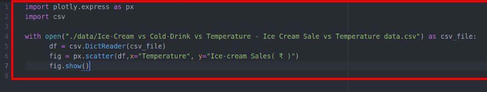{width="6.5in"
height="1.2402777777777778in"}

> © 2019The content of this email is confidential and intended for the
> recipient specified in message only. It is strictly forbidden to
>
> share any part of this message with any third party without a written
> consent of the sender. If you received this message by mistake, please
> reply to this message and follow with its deletion, so that we can
> ensure such a mistake does not occur in the future.

+-----------------+---------------------------------------------------+
| > **PRO-C106 ** | > {width="1.5736100174978127in" |
|                 | > height="0.39444444444444443in"}                 |
+-----------------+---------------------------------------------------+

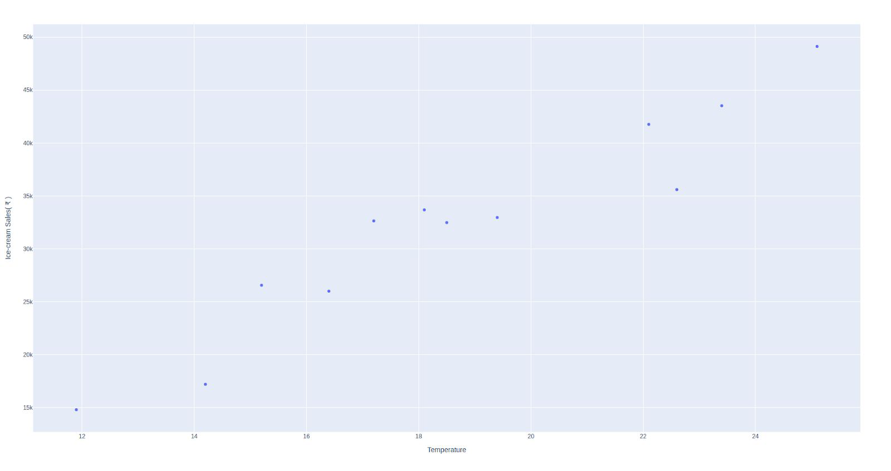{width="6.5in"
height="3.448611111111111in"}

> Then we saw the inversely correlated data.
>
> In this data we saw that as the coffee consumption increases the hours
> of sleep a person gets decreases.

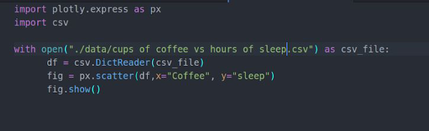{width="6.5in"
height="1.9902777777777778in"}

> © 2019The content of this email is confidential and intended for the
> recipient specified in message only. It is strictly forbidden to
>
> share any part of this message with any third party without a written
> consent of the sender. If you received this message by mistake, please
> reply to this message and follow with its deletion, so that we can
> ensure such a mistake does not occur in the future.

+-----------------+---------------------------------------------------+
| > **PRO-C106 ** | > {width="1.5736100174978127in" |
|                 | > height="0.39444444444444443in"}                 |
+-----------------+---------------------------------------------------+

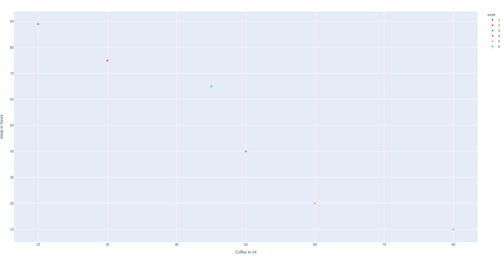{width="6.5in"
height="3.4069444444444446in"}

> **We learned that correlation can be calculated as well.**
>
> A correlation of 1 means the two data sets are closely correlated.
> This will be a rising graph where the data points are close to a
> central line.
>
> A correlation of -1 means that the two data sets are inversely
> correlated. This will be a falling graph where the data points are
> close to a central line.
>
> A correlation of 0 means that the two data sets are not correlated at
> all! The data points will be scattered on the graph.
>
> Correlation always lies in between -1 and 1.
>
> We wrote code to find the correlation between the temperature and
> ice-cream sales.
>
> © 2019The content of this email is confidential and intended for the
> recipient specified in message only. It is strictly forbidden to
>
> share any part of this message with any third party without a written
> consent of the sender. If you received this message by mistake, please
> reply to this message and follow with its deletion, so that we can
> ensure such a mistake does not occur in the future.

+-----------------+---------------------------------------------------+
| > **PRO-C106 ** | > {width="1.5736100174978127in" |
|                 | > height="0.39444444444444443in"}                 |
+-----------------+---------------------------------------------------+

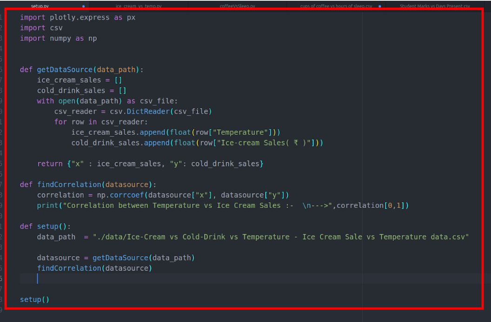{width="6.5in"
height="4.259722222222222in"}

> 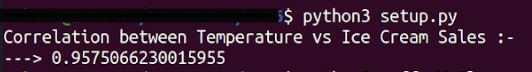{width="5.541666666666667in"
> height="0.75in"}
>
> We then plotted a scatter plot forTV watched in a week on average vs
> the size of television.

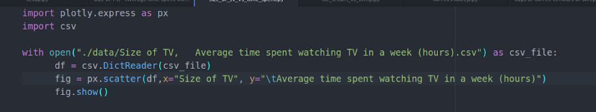{width="6.5in"
height="1.238888888888889in"}

> © 2019The content of this email is confidential and intended for the
> recipient specified in message only. It is strictly forbidden to
>
> share any part of this message with any third party without a written
> consent of the sender. If you received this message by mistake, please
> reply to this message and follow with its deletion, so that we can
> ensure such a mistake does not occur in the future.

+-----------------+---------------------------------------------------+
| > **PRO-C106 ** | > {width="1.5736100174978127in" |
|                 | > height="0.39444444444444443in"}                 |
+-----------------+---------------------------------------------------+

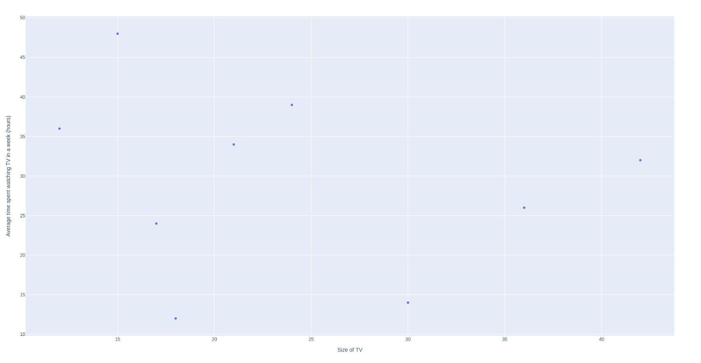{width="6.5in"
height="3.375in"}

> We saw that the points are scattered and dataset is not correlated at
> all.
>
> We wrote code to calculate the correlation between TV watched in a
> week on average vs the size of television.

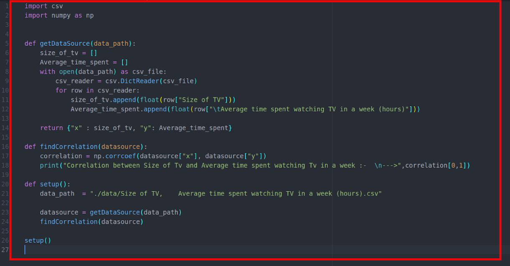{width="6.5in"
height="3.4069444444444446in"}

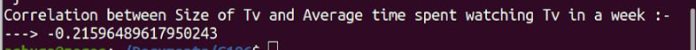{width="6.5in"
height="0.4583333333333333in"}

> © 2019The content of this email is confidential and intended for the
> recipient specified in message only. It is strictly forbidden to
>
> share any part of this message with any third party without a written
> consent of the sender. If you received this message by mistake, please
> reply to this message and follow with its deletion, so that we can
> ensure such a mistake does not occur in the future.

+-----------------+---------------------------------------------------+
| > **PRO-C106 ** | > {width="1.5736100174978127in" |
|                 | > height="0.39444444444444443in"}                 |
+-----------------+---------------------------------------------------+

> We saw another dataset ,**number of days students attended college vs
> the marks they scored in their exams.**

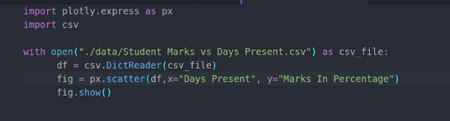{width="6.5in"
height="1.75in"}

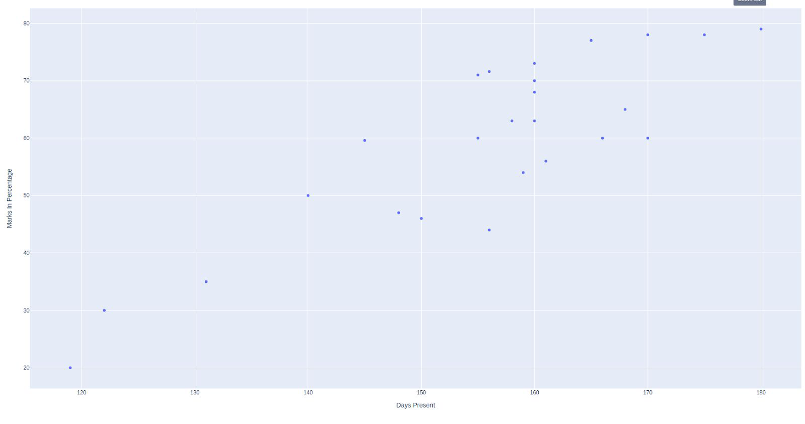{width="6.5in"
height="3.426388888888889in"}

> **Here we saw that the data points are close to each other and the two
> data are positively correlated.**
>
> **Then we wrote code to calculate the correlation .**
>
> © 2019The content of this email is confidential and intended for the
> recipient specified in message only. It is strictly forbidden to
>
> share any part of this message with any third party without a written
> consent of the sender. If you received this message by mistake, please
> reply to this message and follow with its deletion, so that we can
> ensure such a mistake does not occur in the future.

+-----------------+---------------------------------------------------+
| > **PRO-C106 ** | > {width="1.5736100174978127in" |
|                 | > height="0.39444444444444443in"}                 |
+-----------------+---------------------------------------------------+

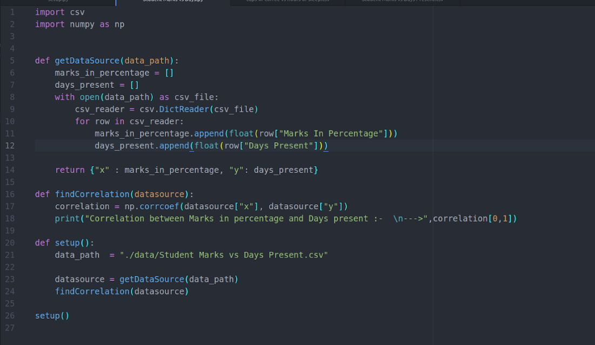{width="6.5in"
height="3.7819444444444446in"}

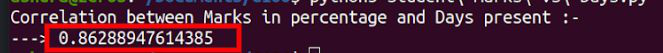{width="6.5in"
height="0.5111111111111111in"}

> **What's next? **
>
> In the next class, we will learn to find correlation. 
>
> © 2019The content of this email is confidential and intended for the
> recipient specified in message only. It is strictly forbidden to
>
> share any part of this message with any third party without a written
> consent of the sender. If you received this message by mistake, please
> reply to this message and follow with its deletion, so that we can
> ensure such a mistake does not occur in the future.
